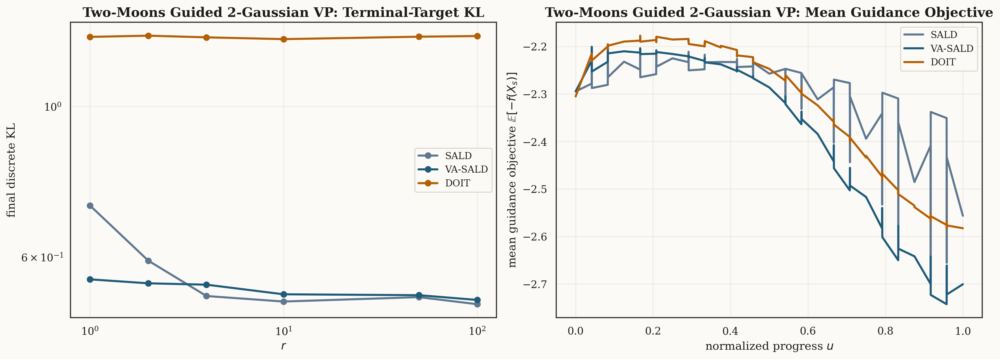
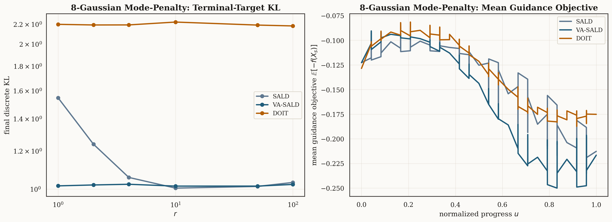
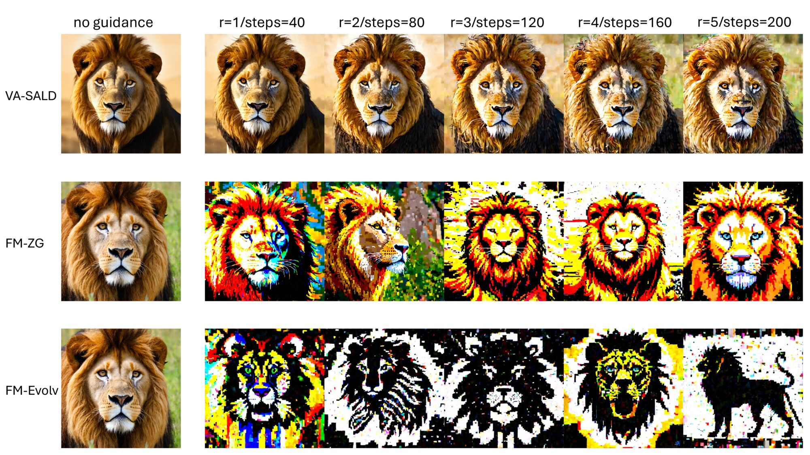

# Slowly Annealed Langevin Dynamics

Official code for **Slowly Annealed Langevin Dynamics: Theory and Applications to Training-Free Guided Generation**.

Project page: <https://sites.google.com/site/atsushinitanda/va-sald>

VA-SALD is a training-free guided generation framework for pretrained generative models whose marginal path is induced by an Itô diffusion.  The implementation principle is to adapt the VA-SALD drift to the backbone's own forward process, rather than treating every sampler as the same black box.  This repository currently exposes two reproducible examples:

- [`sald_Gaussian_Moon/`](sald_Gaussian_Moon/): synthetic VP-diffusion experiments comparing SALD, VA-SALD, and DOIT on guided Gaussian mixtures.
- [`sald_FM_SD35/`](sald_FM_SD35/): VA-SALD for the flow-matching Itô formulation of Stable Diffusion 3.5 Medium with zeroth-order black-box guidance.

## Key Results

The synthetic experiments are fully reproducible on CPU or GPU and include the main paper panels.

<p align="center">
  
  
</p>

For the text-to-image experiment, `sald_FM_SD35` implements the flow-matching version of VA-SALD for SD3.5-M and supports Aesthetic, PickScore, and CLIP-based guidance through zeroth-order reward gradients.

<p align="center">
  
</p>

## Quick Start

Clone the repository:

```bash
git clone https://github.com/anitan0925/sald.git
cd sald
```

Run the lightweight synthetic experiments:

```bash
cd sald_Gaussian_Moon
python3 -m venv .venv
source .venv/bin/activate
python3 -m pip install --upgrade pip
python3 -m pip install -r requirements.txt
python3 run_reproduce.py --cpu --smoke
```

If `python3 -m venv` is unavailable on a Debian/Ubuntu machine, install the system package `python3-venv` first, or create an equivalent Conda environment and install `sald_Gaussian_Moon/requirements.txt`.

Run the full synthetic reproduction on a GPU:

```bash
python3 run_reproduce.py --gpu 0
```

Set up the SD3.5 flow-matching experiment:

```bash
cd ../sald_FM_SD35
conda env create -f environment.yaml
conda activate fsd
export PYTHONPATH=$(pwd)
CUDA_VISIBLE_DEVICES=0 accelerate launch --num_processes=1 --main_process_port=0 \
  trainer/VA_SALD_Guidance_zerothorder.py \
  --config config/VA_SALD_Guidance_zerothorder.py:base
```

The SD3.5 experiment downloads pretrained Hugging Face models and therefore requires the usual Hugging Face access setup for `stabilityai/stable-diffusion-3.5-medium`.

## Plug-in Workflow

VA-SALD should be implemented using the pretrained model's own forward Itô process:

```math
dY_\tau = \bar B_\tau(Y_\tau)\,d\tau + \bar\sigma_\tau\,dW_\tau,
\qquad p_t = q_{T-t}.
```

For a guide `f_t` and a slowdown schedule `t(s)`, the continuous-time VA-SALD dynamics are

```math
dX_s =
\left(
\dot t(s)u_{t(s)}(X_s)
+ \frac{\sigma_{t(s)}^2}{2}\nabla\log p_{t(s)}(X_s)
- \frac{\sigma_{t(s)}^2}{2}\nabla f_{t(s)}(X_s)
\right)ds
+ \sigma_{t(s)}dW_s.
```

Equivalently,

```math
dX_s =
\left(
-\dot t(s)B_{t(s)}(X_s)
+ (\dot t(s)+1)\frac{\sigma_{t(s)}^2}{2}\nabla\log p_{t(s)}(X_s)
- \frac{\sigma_{t(s)}^2}{2}\nabla f_{t(s)}(X_s)
\right)ds
+ \sigma_{t(s)}dW_s.
```

The exact implementation depends on what the backbone predicts: noise, score, velocity, denoised sample, or flow-matching velocity.  We include an AI-assistant prompt template in [`docs/AI_ASSISTANT_PLUGIN_PROMPT.md`](docs/AI_ASSISTANT_PLUGIN_PROMPT.md) that asks an assistant to derive and implement the correct VA-SALD update for a new diffusion-based model.

## Repository Layout

```text
sald_Gaussian_Moon/   Synthetic VP-diffusion experiments and paper figures.
sald_FM_SD35/         Flow-matching VA-SALD for Stable Diffusion 3.5 Medium.
docs/                 Plug-in adaptation prompt and implementation notes.
LICENSE               MIT license.
CITATION.bib          BibTeX citation.
```

## Citation

```bibtex
@misc{nitanda2026SALD,
  author = {{Nitanda}, Atsushi and {Bu}, Dake and {Lyu}, Yueming and {Veeravalli}, Tanya},
  title = {{Slowly Annealed Langevin Dynamics: Theory and Applications to Training-Free Guided Generation}},
  year = {2026},
  month = {April},
  note = {Article page: \url{https://sites.google.com/site/atsushinitanda/va-sald}}
}
```

## Acknowledgments

The synthetic experiments include a DOIT-style baseline adapted from the <https://github.com/liamyzq/Doob_training_free_adaptation>.  The SD3.5 flow-matching experiment builds on Hugging Face Diffusers and pretrained Stability AI models.
